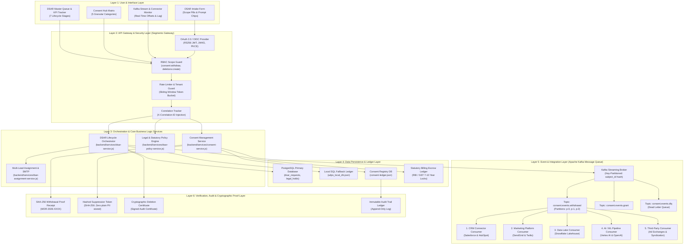
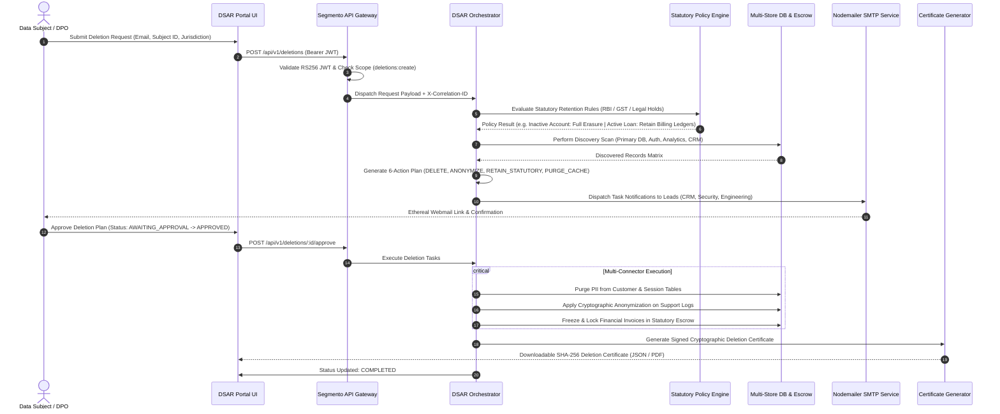
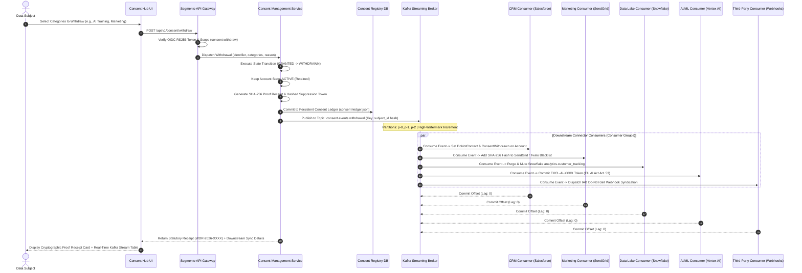

# Segmento DSAR Portal & Consent Hub: Comprehensive Architecture & Flow Documentation

> **Enterprise Privacy Engineering & Compliance Platform**  
> Implements end-to-end statutory compliance with **GDPR (Articles 7, 15, 17, 21)**, **India DPDP Act 2023 (Sections 6, 11, 12)**, **Singapore PDPA (Section 16)**, **California CCPA/CPRA**, and statutory financial retention mandates (**RBI Master Direction / GST 7-10 Year Locks**).

---

## 1. Executive Summary & Legal Compliance Framework

The **DSAR (Data Subject Access Request) Portal & Consent Hub** is an enterprise privacy engineering solution designed to orchestrate customer data subject rights across distributed microservices, databases, CRM systems, analytical data lakes, and AI/ML model fine-tuning pipelines.

### Core Legal & Architectural Distinction

A fundamental architectural principle of this system is the strict separation between **Account Deletion (Right to Erasure)** and **Granular Consent Withdrawal (Right to Object)**:

```
┌──────────────────────────────────────────────────────────────────────────────────────────────────┐
│                                     DATA SUBJECT RIGHTS DICHOTOMY                                │
├─────────────────────────────────────────┬────────────────────────────────────────────────────────┤
│     ACCOUNT DELETION (GDPR Art. 17)     │         CONSENT WITHDRAWAL (GDPR Art. 7(3))            │
├─────────────────────────────────────────┼────────────────────────────────────────────────────────┤
│ • Customer account is TERMINATED.       │ • Customer account remains ACTIVE & RETAINED.          │
│ • PII permanently erased or anonymized. │ • Granular processing authorizations revoked.          │
│ • Irreversible erasure across DBs.      │ • Marketing queues, AI training & telemetry stopped.   │
│ • Statutory retention overrides apply   │ • Customer can re-opt-in at any time.                  │
│   (RBI/GST billing ledger locks).       │ • Near-real-time Kafka event streaming enforcement.    │
│ • Generates Deletion Certificate.       │ • Generates SHA-256 Proof of Withdrawal Receipt.       │
└─────────────────────────────────────────┴────────────────────────────────────────────────────────┘
```

---

## 2. System Architecture: The 6-Layer Architecture Stack

The platform is designed around a decoupled, highly resilient 6-layer architecture stack:



---

## 3. End-to-End Workflow Pictures (Sequence Diagrams)

### Flow 1: Full Privacy Deletion Lifecycle (GDPR Art. 17 / DPDP Sec. 12)

This workflow outlines how a customer or compliance operator triggers, verifies, approves, and executes a full account erasure across enterprise connectors while enforcing statutory retention locks.



---

### Flow 2: Granular Consent Withdrawal & Kafka Downstream Enforcement (GDPR Art. 7(3))

This workflow illustrates how a data subject withdraws consent for specific processing categories without deleting their account, streaming events through Apache Kafka to 5 downstream consumers in real time.



---

## 4. Deep-Dive into the 8 DSAR Portal Subviews

The DSAR Portal user interface is organized into 8 modular subviews accessible via the dedicated portal navigation:

```
[DSAR Portal Top Header]
   ├── 1. Intake Workspace            ── Create new erasure/DSAR requests
   ├── 2. Master Request Queue        ── Track SLAs, statuses, and multi-filter queue
   ├── 3. Discovery & Impact Engine   ── Automated cross-database PII discovery
   ├── 4. Execution & Orchestration   ── Step-by-step connector task execution
   ├── 5. Verification & Certificates ── Cryptographic proof of erasure generator
   ├── 6. Team & SLA Settings Hub     ── Department assignments, SLAs, and SMTP
   ├── 7. Consent Hub Matrix          ── Granular 5-category opt-out manager
   └── 8. Kafka Stream Monitor        ── Live broker, consumer lag & enforcement ledger
```

---

### Subview 1: Request Intake & Scoping
* **Scope Selector**: Three preset scopes:
  - `Full Account Erasure (GDPR Art. 17)`
  - `Granular Consent Revocation (GDPR Art. 7(3))`
  - `Marketing Only Suppression (ePrivacy Directive)`
* **Pre-fill Presets**: Quick-fill chips for test personas (`Alex Johnson`, `John Smith`, `Corporate Entity`).
* **Identity Validation**: Captures email, customer ID, jurisdiction, statutory reason, and optional proof attachments.

---

### Subview 2: Master Request Queue & Real-Time KPI Dashboard
* **KPI Metric Cards**: Total Requests, Completed, In-Progress, Pending Approval, and Statutory Retentions.
* **7-Stage Lifecycle Tracker**:
  1. `CREATED`
  2. `DISCOVERY_PENDING`
  3. `DISCOVERED`
  4. `PLAN_READY`
  5. `AWAITING_APPROVAL`
  6. `EXECUTING`
  7. `COMPLETED` (or `CANCELLED`)
* **Real-time Filters**: Search by Request ID, email, jurisdiction, status, or date range.

---

### Subview 3: Discovery & Impact Analysis Engine
* **Automated Data Discovery**: Scans connected databases, caches, file stores, and analytics tables for occurrences of the subject's identifier.
* **PII Classification**: Identifies structured PII (email, phone, tax ID), behavioral logs (clickstream), and transactional invoices.
* **Dependency Analysis**: Identifies inter-service dependencies (e.g., active subscriptions that must be canceled before deletion).

---

### Subview 4: Execution Engine & Multi-Connector Orchestration
* **Action Types**:
  - `PERMANENT_DELETE`: Hard purge from operational DBs.
  - `CRYPTOGRAPHIC_ANONYMIZATION`: Irreversible salt-hashing of support tickets.
  - `STATUTORY_FREEZE`: Placing invoices under RBI/GST legal hold escrow.
  - `CACHE_INVALIDATION`: Flushing Redis and memory caches.
* **Multi-Lead Task Distribution**: Dispatches subtasks to designated department leads (CRM, Security, Legal, Engineering).

---

### Subview 5: Verification & Cryptographic Deletion Certificate
* **Post-Execution Verification**: Runs automated queries to confirm zero residual PII remains in operational stores.
* **Signed Deletion Certificate**: Generates a tamper-proof certificate containing:
  - Unique Certificate ID (`CERT-DEL-2026-XXXX`)
  - Target subject identifier
  - Timestamp of execution
  - List of affected databases and tables
  - SHA-256 cryptographic hash of the execution ledger.

---

### Subview 6: Team Configuration, SLA Policies & Multi-Lead SMTP Inboxes
* **SLA Configuration**: Set statutory deadlines (e.g., 30 days for GDPR, 15 days for DPDP).
* **Operator Switcher**: Seamlessly switch between DPO, Privacy Engineer, Legal Lead, and System Admin roles.
* **SMTP Webmail Integration**: Live Nodemailer transport with zero-config **Ethereal Test Inboxes** allowing one-click preview of real email notifications sent to department leads.

---

### Subview 7: Consent Hub & Granular 5-Category Matrix
* **Subject Lookup**: Scans any customer identifier and renders their current consent permissions.
* **The 5 Standard Granular Categories**:
  1. **📢 Marketing & Promotional Communications** (`MARKETING_COMMUNICATIONS`) — Syncs to Braze, SendGrid, Twilio.
  2. **🧠 AI & ML Model Training** (`AI_MODEL_TRAINING`) — Syncs to Vertex AI, fine-tuning datasets under EU AI Act Art. 53.
  3. **📊 Behavioral Tracking & Web Telemetry** (`BEHAVIORAL_TRACKING`) — Syncs to Snowflake Lakehouse, GA4, Segment.
  4. **🤝 Third-Party & Affiliate Sharing** (`THIRD_PARTY_SHARING`) — Syncs to ad exchanges and affiliate brokers.
  5. **🛡️ Biometric & Voice Telemetry** (`BIOMETRIC_TELEMETRY`) — Syncs to biometric authentication clusters.
* **Cryptographic Proof of Withdrawal Receipt**: Generates instant `WDR-2026-XXXX` receipts with SHA-256 hash and suppression tokens.
* **Re-Granting (Opt-In)**: Allows voluntary reactivation of consent categories.

---

### Subview 8: Kafka Message Queue & Downstream Enforcement Monitor
* **Cluster Health Status**: Active brokers, topic partition counts, high watermarks, and consumer lag.
* **5 Downstream Connector Cards**: Real-time status cards showing live action statuses, processed event counters, and green health indicators.
* **Live Kafka Event Log**: Real-time table streaming topic records with partition ID, offset, key, event ID, and `ACK_COMMITTED` status.
* **Downstream Enforcement Action Ledger**: Audit log of downstream system enforcement events.
* **Stream Replay Button**: Allows compliance officers to trigger a live stream replay from offset 0.

---

## 5. Downstream Enforcement Connector Specifications

| Connector | Target Systems | Consumer Group ID | Actions Enforced on Withdrawal | Statutory Basis |
|---|---|---|---|---|
| **1. CRM Connector** | Salesforce, HubSpot, Braze | `crm-enforcement-group` | Sets `DoNotContact: true` and `ConsentWithdrawn: true` on Account/Lead records. | GDPR Art. 21 / DPDP Sec. 6 |
| **2. Marketing Platform** | SendGrid, Twilio SMS | `marketing-platform-group` | Inserts SHA-256 hashed suppression token into global unsubscribe & SMS STOP tables. | ePrivacy Directive |
| **3. Data Lake & Warehouse** | Snowflake Analytics Lakehouse | `datalake-snowflake-group` | Mutes telemetry ingestion pipeline and purges partition `analytics.customer_tracking_events`. | GDPR Art. 6(1)(a) |
| **4. AI / ML Pipeline** | Vertex AI, OpenAI Fine-Tuning | `aiml-training-exclusion-group` | Issues and commits `EXCL-AI-XXXX` exclusion token to omit customer chats and documents from LLM training sets. | EU AI Act Art. 53 |
| **5. Third-Party Systems** | Ad Exchanges, Affiliate Brokers | `thirdparty-syndication-group` | Dispatches IAB Do-Not-Sell / Do-Not-Share webhooks and partner opt-out sync signals. | CCPA / CPRA |

---

## 6. Complete REST API Reference

All routes are protected by the **Segmento API Gateway** with OAuth 2.0 / RS256 JWT validation, rate limiting, and RBAC scope guards.

### Consent Management & Kafka APIs (`/api/v1/consent/*`)

| Method | Endpoint | Required Scope | Description |
|---|---|---|---|
| `GET` | `/api/v1/consent/categories` | `consent:read` | Returns all 5 supported granular consent categories and metadata. |
| `GET` | `/api/v1/consent/status/:id` | `consent:read` | Returns the active consent state matrix and audit history for a subject. |
| `POST` | `/api/v1/consent/withdraw` | `consent:withdraw` | Executes granular consent withdrawal, publishes Kafka event, and generates SHA-256 receipt. |
| `POST` | `/api/v1/consent/grant` | `consent:grant` | Re-grants consent for specified categories (Opt-In). |
| `GET` | `/api/v1/consent/receipt/:id` | `consent:read` | Retrieves cryptographic proof of withdrawal receipt by receipt ID. |
| `GET` | `/api/v1/consent/history/:id` | `consent:read` | Retrieves full immutable consent audit trail for an identifier. |
| `GET` | `/api/v1/consent/ledger` | `consent:admin` | DPO master ledger overview across all subjects. |
| `GET` | `/api/v1/consent/kafka/metrics` | `consent:read` | Returns Kafka cluster status, topic partitions, high watermarks, and consumer lag. |
| `GET` | `/api/v1/consent/kafka/events` | `consent:read` | Returns live Kafka event stream log (supports `?topic=` and `?limit=`). |
| `GET` | `/api/v1/consent/kafka/connectors` | `consent:read` | Returns live health, processed counts, and status of all 5 downstream connectors. |
| `GET` | `/api/v1/consent/kafka/ledger` | `consent:read` | Returns the downstream connector enforcement action ledger. |
| `POST` | `/api/v1/consent/kafka/replay` | `consent:withdraw` | Replays Kafka event stream from a specific offset across consumer groups. |

---

### DSAR Deletion APIs (`/api/v1/deletions/*`)

| Method | Endpoint | Required Scope | Description |
|---|---|---|---|
| `POST` | `/api/v1/deletions` | `deletions:create` | Creates a new DSAR erasure request (Status: `CREATED`). |
| `GET` | `/api/v1/deletions` | `deletions:read` | Lists all DSAR requests with filtering and pagination. |
| `GET` | `/api/v1/deletions/:id` | `deletions:read` | Gets full request state, stage, discovery findings, and audit history. |
| `POST` | `/api/v1/deletions/:id/discover` | `deletions:create` | Triggers automated cross-system PII discovery scan. |
| `POST` | `/api/v1/deletions/:id/plan` | `deletions:create` | Generates 6-action deletion and statutory retention plan. |
| `POST` | `/api/v1/deletions/:id/approve` | `deletions:admin` | Approves plan for execution. |
| `POST` | `/api/v1/deletions/:id/execute` | `deletions:admin` | Executes multi-connector erasure tasks. |
| `POST` | `/api/v1/deletions/:id/verify` | `deletions:read` | Verifies zero PII residue across target stores. |
| `GET` | `/api/v1/deletions/:id/certificate`| `deletions:read` | Downloads signed cryptographic deletion certificate. |
| `POST` | `/api/v1/deletions/:id/cancel` | `deletions:admin` | Cancels request with reason before execution. |

---

## 7. Automated Testing & Verification Report

The entire platform is covered by an automated test suite verifying both functional and regulatory constraints:

* **Total Test Suites**: **20 passed out of 20 (100%)**
* **Total Automated Tests**: **234 passed out of 234 (100%)**
* **Zero Regressions**: All file protection (AES-256-GCM), database masking, OAuth 2.0 Gateway, DSAR orchestration, and Kafka streaming tests pass consistently.

### Core Test Files Reference
- Kafka & Downstream Integration: `tests/kafka-consent-integration.test.js` (13 tests)
- Consent State Machine & Receipts: `tests/consent-withdrawal.test.js` (9 tests)
- OAuth 2.0 / OIDC Gateway: `tests/gateway-oauth.test.js` (17 tests)
- DSAR Multi-Stage Deletion API: `tests/data-deletion-api.test.js` (15 tests)
- Multi-Lead Task Assignment & SLA: `tests/dsar-assignment.test.js` (8 tests)
- Legal & Statutory Retention Engine: `tests/dsar-policy.test.js` (9 tests)
